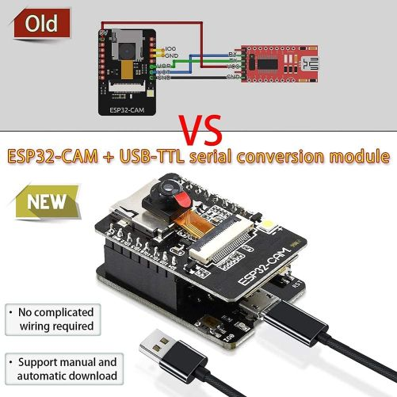
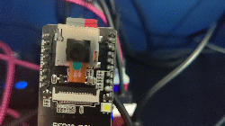
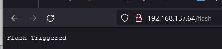

# ESP32 CAM Labs

This repo contains several demos and labs working with an ESP32 Cam board. I'm currently using a development board that avoid me the wiring and soldering.

# Demos

## Flash Demo

This project turn on and off the flash of the camera. It's a simple demo that you can use to test the LED pin.

Source code available on [ESPCamFlashDemo folder](./ESPCamFlashDemo).

## WebServer to turn on the Flash with an HTTP Endpoint

This project connects the ESP32 Cam board to a Wifi network and provides an HTTP endpoint to turn on the flash.

Source code available on [ESPCamWebServer folder](./ESPCamWebServer).

## Additional Resources

In my personal blog "[ElBruno.com](https://elbruno.com)", I wrote about several scenarios on how to work and code with [ESP32 CAM](https://elbruno.com/tag/esp32cam/). 

## Author

👤 **Bruno Capuano**

* Website: https://elbruno.com
* Twitter: [@elbruno](https://twitter.com/elbruno)
* Github: [@elbruno](https://github.com/elbruno)
* LinkedIn: [@elbruno](https://linkedin.com/in/elbruno)

## 🤝 Contributing

Contributions, issues and feature requests are welcome!

Feel free to check [issues page](https://github.com/elbruno/ESP32camDemos/issues).

## Show your support

Give a ⭐️ if this project helped you!

## 📝 License

Copyright &copy; 2021 [Bruno Capuano](https://github.com/elbruno).

This project is [MIT](/LICENSE) licensed.

***